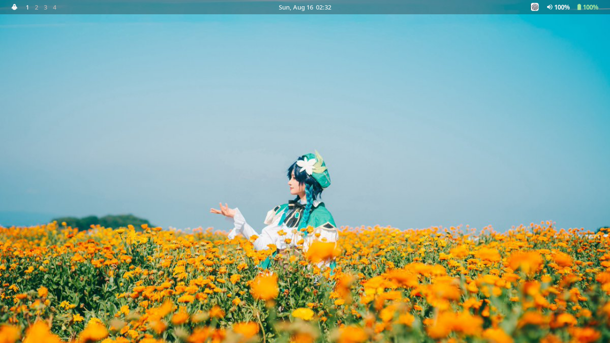
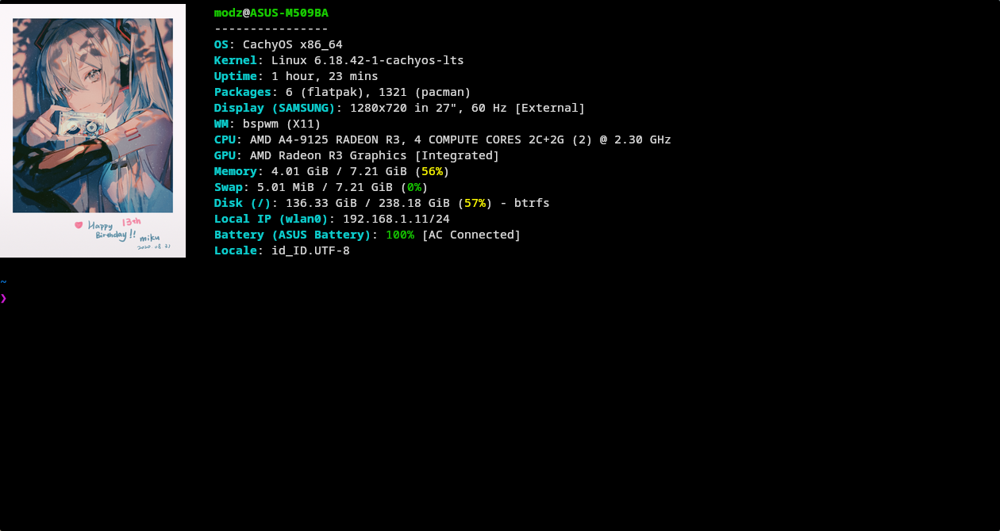
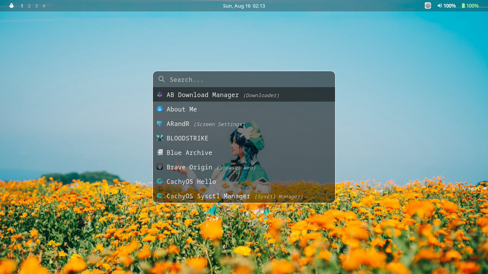
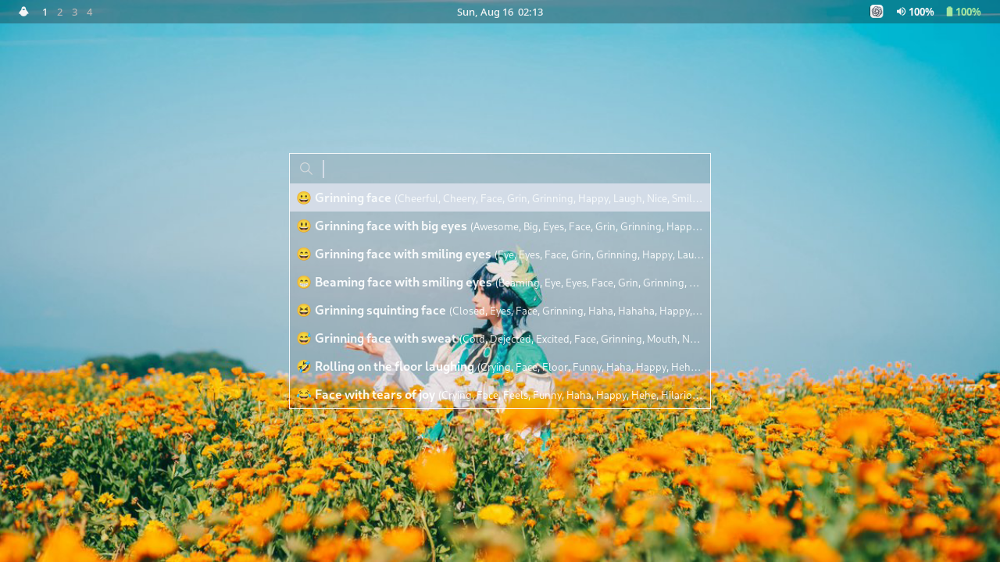
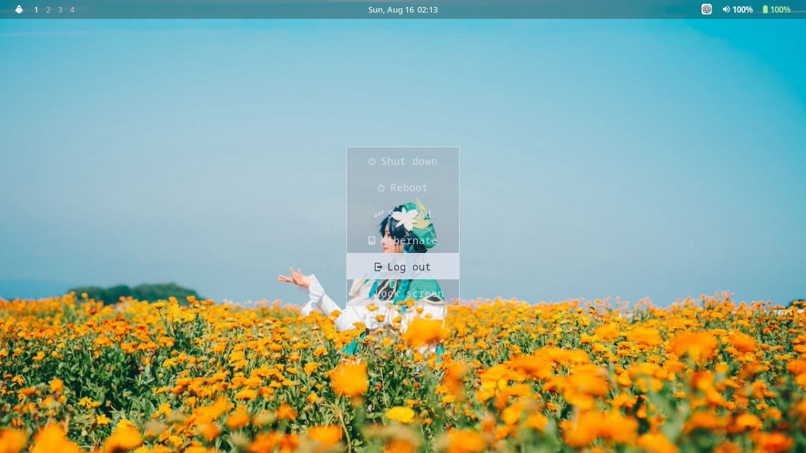

# bspWmek Dotfiles

<p align="center">

A clean and lightweight bspwm desktop environment for Arch Linux and CachyOS, built around a minimal X11 workflow with Rofi, Polybar, Picom, and Dunst.

</p>

<p align="center">


</p>

> Lightweight by design. Clean enough for screenshots, practical enough for daily use.

---

# Table of Contents

- [Preview](#preview)
- [Fastfetch](#fastfetch)
- [Layout Modes](#layout-modes)
- [Features](#features)
- [Appearance](#appearance)
- [Requirements](#requirements)
- [Dependencies](#dependencies)
- [Installation](#installation)
- [Keybindings](#keybindings)
- [Credits](#credits)
- [License](#license)

---

# Preview



---

# Fastfetch

> **Kitty terminal is recommended.**

Fastfetch image preview uses the **Kitty Graphics Protocol**. Other terminals may not render images correctly.



---

# Features

## 🖥️ Desktop

- bspwm Window Manager
- Polybar status bar
- Tint2 taskbar
- Multiple workspace support
- Window focus and swapping
- Fullscreen and minimize support
- Lightweight X11-based desktop environment

---

## 🚀 Application Launcher

A fast and minimal Rofi-based application launcher for launching installed applications.



---

## 😀 Emoji Picker

A simple Rofi-based emoji picker for quickly searching and inserting emojis without opening a separate application.



---

## ⚡ Power Menu

A compact power menu for common session and system actions.

Supports:

- Shutdown
- Reboot
- Suspend
- Hibernate
- Log out
- Lock screen



---

## 📊 Mission Center

Built-in graphical system monitor.

Features

- CPU Usage
- Memory Usage
- GPU Information
- Disk Usage
- Network Activity
- Process Viewer

Launch via

- Context Menu
- <kbd>Ctrl</kbd> + <kbd>Shift</kbd> + <kbd>Esc</kbd>

---

# Appearance

| Component | Theme |
|-----------|-------|
| Window Manager | bspwm |
| bspwm Theme | Kaunas |
| GTK Theme | Fluent |
| Icon Theme | Eleven |
| Cursor Theme | Win11OSX |
| System Font | Sans Regular 10 |
| Terminal | Kitty |
| Terminal Font | Noto Sans Mono Regular |

---

# Extras

- Wallpaper manager
- Window snapping
- Screenshot utility
- Brightness control
- Volume control
- Music control

---

# Requirements

## Operating System

- Arch Linux
- CachyOS *(Recommended)*

## Display Server

- Xorg (X11)

## Window Manager

- bspwm

## Terminal

- Kitty *(required for Fastfetch image preview)*

## Themes

| Component | Theme |
|-----------|-------|
| GTK | [Fluent](https://github.com/vinceliuice/Fluent-gtk-theme) |
| Icons | [Eleven](https://www.gnome-look.org/p/2297057) |
| Cursor | [Win11OSX](https://www.gnome-look.org/p/2297057) |
| bspwm | [Kaunas](https://github.com/Dovias/Kaunas) |
| Display Manager | [SilentSDDM](https://github.com/uiriansan/SilentSDDM) |

## Fonts

Required fonts

- JetBrainsMono Nerd Font
- Material Design Icons Desktop
- Source Han Code JP
- Symbols Nerd Font Mono

System UI

- Sans Regular 10

---

# Dependencies

## Core

```bash
bspwm
xorg-server
xorg-xinit
xorg-xrandr
xorg-xset
polybar
snixembed
picom-ftlabs-git
rofi
dunst
feh
playerctl
brightnessctl
alsa-utils
networkmanager
pavucontrol
polkit-gnome
qt5-base
qt5-tools
kitty
pcmanfm
wmctrl
```

## Utilities

```bash
rofi-emoji
rofi-power-menu
fastfetch
pamixer
scrot
xclip
ffmpeg
imagemagick
mission-center
git
brave-origin-bin
nano
wget
curl
unzip
ananicy-cpp
cachyos-ananicy-rules
cava
htop
libnotify
geany
inter-font
ttf-jetbrains-mono-nerd
ttf-material-design-icons-desktop
adobe-source-han-code-jp-fonts
ttf-ibm-plex
cantarell-fonts
noto-fonts
ttf-liberation
ttf-dejavu
ttf-nerd-fonts-symbols-mono
```

---

# Installation

> [!IMPORTANT]
> bspWmek Dotfiles is designed for **Arch Linux** and **CachyOS** using **bspwm** and **Xorg**.

Clone the repository.

```bash
git clone https://github.com/sdqfrmnsyh/bspWmek-dotfiles.git
```

Enter the repository.

```bash
cd bspWmek-Dotfiles
```

Run the installer.

```bash
chmod +x install.sh
./install.sh
```

The installer will automatically:

- Install **yay** and **chaotic-aur** (if not already installed)
- Install all required dependencies and fonts
- Copy all dotfiles into your **Home** directory
- Install additional system configurations
- Set executable permissions
- Reload bspwm

> [!WARNING]
> Existing files with the same name **will be overwritten**.
>
> If you already have your own dotfiles, create a backup before continuing.

---

# Keybindings

## Applications

| Shortcut | Action |
|----------|--------|
| <kbd>Super</kbd> + <kbd>R</kbd> | Open Application Launcher |
| <kbd>Super</kbd> + <kbd>.</kbd> | Open Emoji Picker |
| <kbd>Super</kbd> + <kbd>Esc</kbd> | Open Power Menu |
| <kbd>XF86Explorer</kbd> | Open File Manager |
| <kbd>XF86Calculator</kbd> | Open Calculator |
| <kbd>Ctrl</kbd> + <kbd>Shift</kbd> + <kbd>Esc</kbd> | Open Mission Center |

---

## BSPWM

### Window Management

| Shortcut | Action |
|----------|--------|
| <kbd>Alt</kbd> + <kbd>F4</kbd> | Close Window |
| <kbd>Super</kbd> + <kbd>←</kbd> | Focus Window West |
| <kbd>Super</kbd> + <kbd>→</kbd> | Focus Window East |
| <kbd>Super</kbd> + <kbd>↑</kbd> | Focus Window North |
| <kbd>Super</kbd> + <kbd>↓</kbd> | Focus Window South |
| <kbd>Super</kbd> + <kbd>Shift</kbd> + <kbd>←</kbd> | Swap Window West |
| <kbd>Super</kbd> + <kbd>Shift</kbd> + <kbd>→</kbd> | Swap Window East |
| <kbd>Super</kbd> + <kbd>Shift</kbd> + <kbd>↑</kbd> | Swap Window North |
| <kbd>Super</kbd> + <kbd>Shift</kbd> + <kbd>↓</kbd> | Swap Window South |

---

## Workspace

| Shortcut | Action |
|----------|--------|
| <kbd>Super</kbd> + <kbd>1-9</kbd> | Switch Workspace |
| <kbd>Super</kbd> + <kbd>Shift</kbd> + <kbd>1-9</kbd> | Send Window to Workspace |

---

## Window Shortcuts

| Shortcut | Action |
|----------|--------|
| <kbd>Super</kbd> + <kbd>F</kbd> | Toggle Fullscreen |
| <kbd>Super</kbd> + <kbd>X</kbd> | Toggle between floating/tiled |
| <kbd>Super</kbd> + <kbd>Shift</kbd> + <kbd>F</kbd> | Force Restore from Fullscreen |
| <kbd>Super</kbd> + <kbd>Z</kbd> | Minimize Window |
| <kbd>Super</kbd> + <kbd>Shift</kbd> + <kbd>Z</kbd> | Restore Hidden Window |

---

## Screenshots

| Shortcut | Action |
|----------|--------|
| <kbd>Print</kbd> | Full Screenshot |
| <kbd>Ctrl</kbd> + <kbd>Print</kbd> | Delayed Screenshot |
| <kbd>Alt</kbd> + <kbd>Print</kbd> | Active Window Screenshot |
| <kbd>Super</kbd> + <kbd>Shift</kbd> + <kbd>S</kbd> | Area Screenshot |

---

## Multimedia

| Shortcut | Action |
|----------|--------|
| <kbd>XF86AudioRaiseVolume</kbd> | Increase Volume |
| <kbd>XF86AudioLowerVolume</kbd> | Decrease Volume |
| <kbd>XF86AudioMute</kbd> | Toggle Mute |
| <kbd>XF86AudioPlay</kbd> | Play / Pause |
| <kbd>XF86AudioStop</kbd> | Stop |
| <kbd>XF86AudioNext</kbd> | Next Track |
| <kbd>XF86AudioPrev</kbd> | Previous Track |

---

## Brightness

| Shortcut | Action |
|----------|--------|
| <kbd>XF86MonBrightnessUp</kbd> | Increase Brightness |
| <kbd>XF86MonBrightnessDown</kbd> | Decrease Brightness |

---

## Utilities

| Shortcut | Action |
|----------|--------|
| <kbd>XF86HomePage</kbd> | Wallpaper Manager |
| <kbd>Pause</kbd> | Toggle Picom |
| <kbd>Super</kbd> + <kbd>Ctrl</kbd> + <kbd>Shift</kbd> + <kbd>~</kbd> | Toggle Picom |
| <kbd>Super</kbd> + <kbd>Ctrl</kbd> + <kbd>Shift</kbd> + <kbd>B</kbd> | Refresh Display Profile |

---

## Extra

| Shortcut | Action |
|----------|--------|
| <kbd>Super</kbd> + <kbd>Alt</kbd> + <kbd>R</kbd> | Restart BSPWM |
| <kbd>Super</kbd> + <kbd>Alt</kbd> + <kbd>Q</kbd> | Quit BSPWM |
| <kbd>Super</kbd> + <kbd>Alt</kbd> + <kbd>S</kbd> | Reload SXHKD |

---

# Credits

Inspired by

- bspwm Community
- Polybar

---

# License

This project is licensed under the MIT License.
